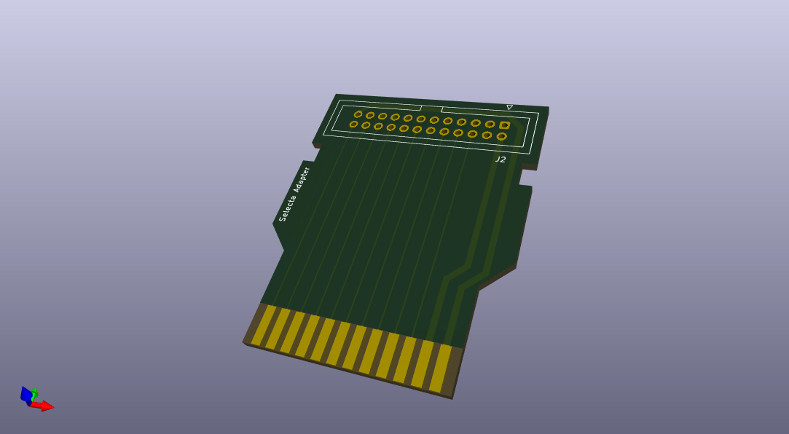

# Selecta Ribbon Cable Adapter

A cartridge PCB for the Atari 2600 for connecting to the Selecta multi-game selector via a ribbon cable.

[Based on the A2k6 Cartridge by Sven Arweiler](https://github.com/sarweiler/a2k6-cart)

